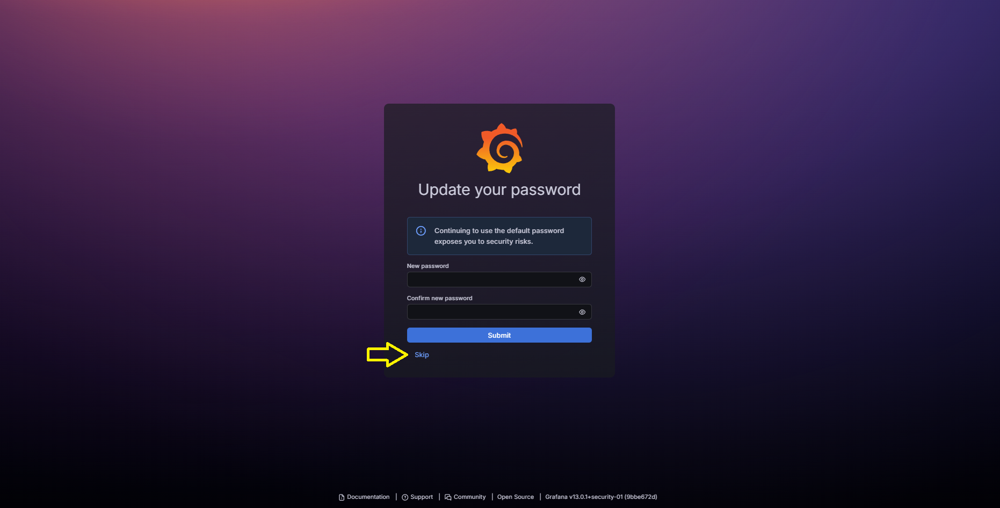
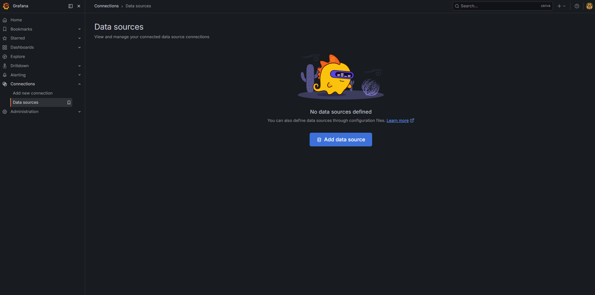
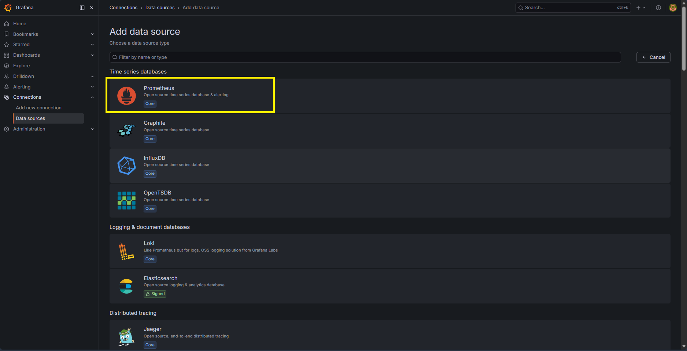
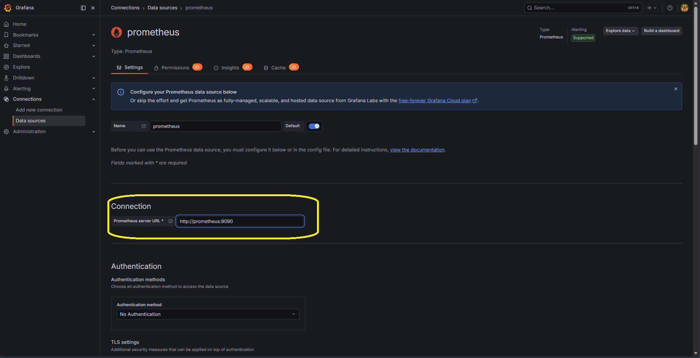
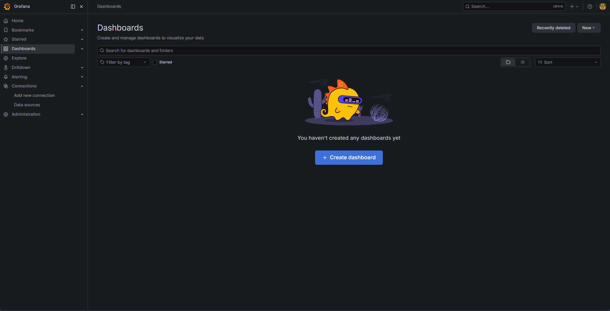
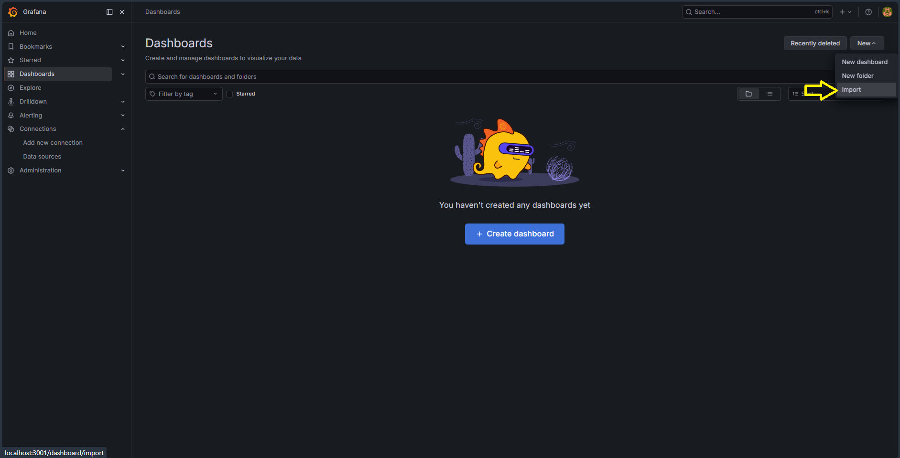
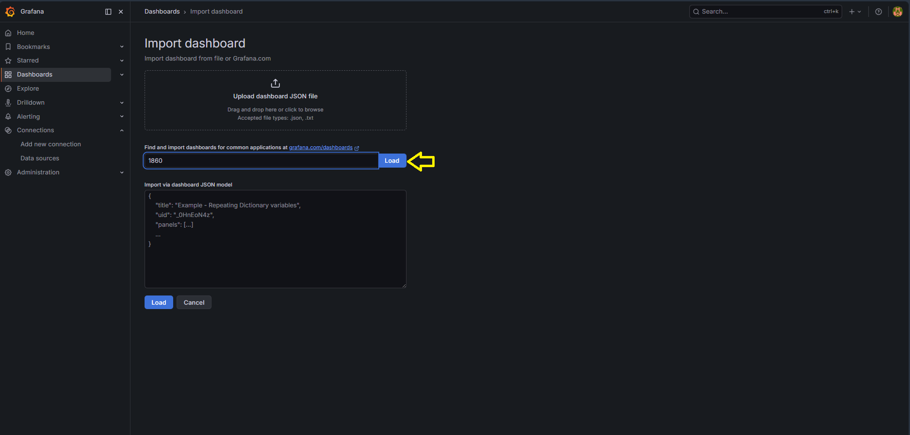
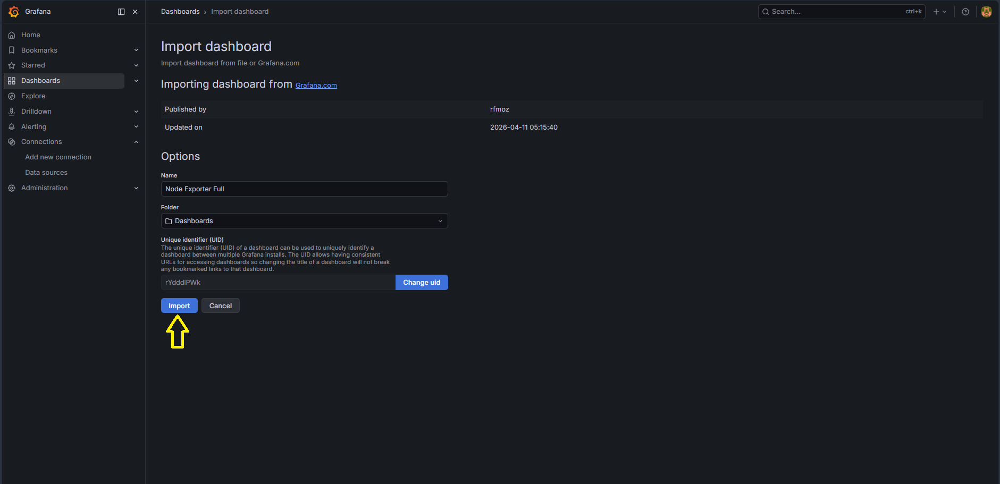
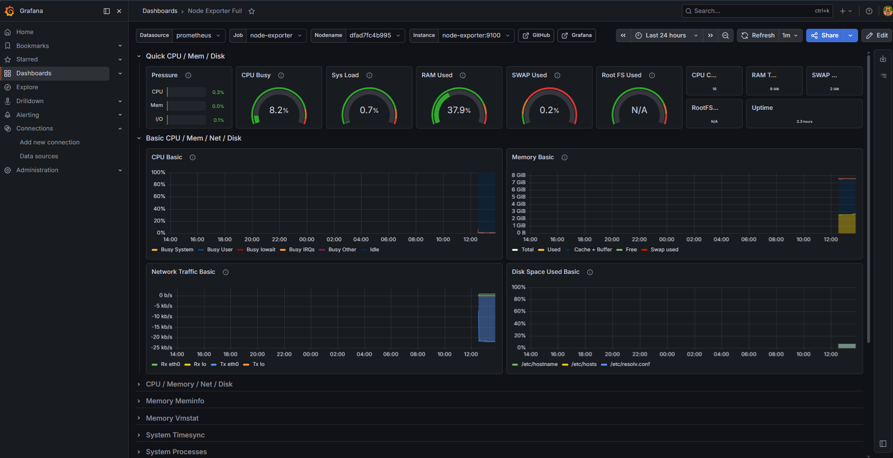

# Desafio Técnico Cubos DevOps - Terraform + Docker + Monitoring

## 📌 Sobre o Projeto

Este projeto foi desenvolvido como solução para um desafio técnico DevOps.

O objetivo foi construir uma aplicação containerizada contendo:

* Frontend
* Backend
* Banco PostgreSQL
* Monitoramento com Prometheus e Grafana
* Provisionamento automatizado com Terraform

Toda a infraestrutura é provisionada localmente utilizando Docker Provider no Terraform.

---

# 🏗️ Arquitetura

```text
Terraform
   ↓
Docker Provider
   ↓
Containers:
- frontend
- backend
- postgres
- prometheus
- grafana
- node-exporter
```

---

# 🚀 Tecnologias Utilizadas

## Infraestrutura

* Terraform
* Docker
* Docker Network
* Docker Volumes

## Backend

* Node.js
* PostgreSQL

## Frontend

* HTML
* JavaScript

## Observabilidade

* Prometheus
* Grafana
* Node Exporter

---

# 📁 Estrutura do Projeto

```text
desafio-cubos-devops/
│
├── backend/
│   ├── Dockerfile
│   ├── index.js
│   └── package.json
│
├── frontend/
│   ├── Dockerfile
│   └── index.html
│
├── database/
│   └── script.sql
│
├── monitoring/
│   └── prometheus.yml
│
├── terraform/
│   ├── main.tf
│   ├── provider.tf
│   └── variables.tf
│
└── README.md
```

---
# ⚙️ Pré-requisitos

Antes de executar o projeto, é necessário possuir as seguintes ferramentas instaladas:

* Docker Desktop
* Terraform
* Git

---

# 🪟 Windows

## Instalar Docker Desktop

1. Baixe o instalador oficial:

```text
https://www.docker.com/products/docker-desktop/
```

2. Durante a instalação:

* habilite o WSL2
* reinicie o computador se solicitado

3. Verifique a instalação:

```powershell
docker --version
```

---

## Instalar Terraform

1. Baixe o binário oficial:

```text
https://developer.hashicorp.com/terraform/downloads
```

2. Extraia o arquivo `.zip`

3. Adicione o executável ao `PATH`

4. Verifique:

```powershell
terraform --version
```

---

## Instalar Git

Download oficial:

```text
https://git-scm.com/download/win
```

Verifique:

```powershell
git --version
```

---

# 🐧 Ubuntu / Linux

## Atualizar repositórios

```bash
sudo apt update && sudo apt upgrade -y
```

---

## Instalar Docker

### Remover versões antigas

```bash
sudo apt remove docker docker-engine docker.io containerd runc
```

---

### Instalar dependências

```bash
sudo apt install -y \
ca-certificates \
curl \
gnupg \
lsb-release
```

---

### Adicionar chave GPG oficial

```bash
curl -fsSL https://download.docker.com/linux/ubuntu/gpg | \
sudo gpg --dearmor -o /usr/share/keyrings/docker-archive-keyring.gpg
```

---

### Adicionar repositório Docker

```bash
echo \
"deb [arch=$(dpkg --print-architecture) signed-by=/usr/share/keyrings/docker-archive-keyring.gpg] \
https://download.docker.com/linux/ubuntu \
$(lsb_release -cs) stable" | \
sudo tee /etc/apt/sources.list.d/docker.list > /dev/null
```

---

### Instalar Docker Engine

```bash
sudo apt update

sudo apt install -y \
docker-ce \
docker-ce-cli \
containerd.io \
docker-buildx-plugin \
docker-compose-plugin
```

---

### Adicionar usuário ao grupo docker

```bash
sudo usermod -aG docker $USER
```

Depois faça logout/login novamente.

---

### Validar instalação

```bash
docker --version
docker compose version
```

---

## Instalar Terraform

```bash
wget -O- https://apt.releases.hashicorp.com/gpg | \
gpg --dearmor | \
sudo tee /usr/share/keyrings/hashicorp-archive-keyring.gpg
```

---

```bash
echo "deb [signed-by=/usr/share/keyrings/hashicorp-archive-keyring.gpg] \
https://apt.releases.hashicorp.com \
$(lsb_release -cs) main" | \
sudo tee /etc/apt/sources.list.d/hashicorp.list
```

---

```bash
sudo apt update && sudo apt install terraform -y
```

---

### Validar instalação

```bash
terraform --version
```

---

## Instalar Git

```bash
sudo apt install git -y
```

---

### Validar instalação

```bash
git --version
```

---

# 🍎 macOS

## Instalar Homebrew

```bash
/bin/bash -c "$(curl -fsSL https://raw.githubusercontent.com/Homebrew/install/HEAD/install.sh)"
```

---

## Instalar Docker Desktop

Download oficial:

```text
https://www.docker.com/products/docker-desktop/
```

---

### Validar instalação

```bash
docker --version
```

---

## Instalar Terraform

```bash
brew tap hashicorp/tap
brew install hashicorp/tap/terraform
```

---

### Validar instalação

```bash
terraform --version
```

---

## Instalar Git

```bash
brew install git
```

---

### Validar instalação

```bash
git --version
```

---

# 🔧 Como Executar o Projeto

---

## 1. Clone o repositório

```bash
git clone https://github.com/GenivaldoSerra/desafio-cubos-devops.git
```

---

## 2. Acesse o diretório do projeto

```bash
cd desafio-cubos-devops
```

---

## 3. Estrutura do Terraform

O projeto possui um arquivo de exemplo:

```text
terraform/terraform.tfvars.example
```

Esse arquivo contém as variáveis utilizadas pelo Terraform para provisionamento da infraestrutura, esse arquivo deve ser renomeado para `terraform.tfvars`.

---

## 4. Renomeando o arquivo `terraform.tfvars.example` para `terraform.tfvars`

Acesse a pasta do Terraform:

```bash
cd terraform
```

### Linux/macOS

```bash
mv terraform.tfvars.example terraform.tfvars
```

### Windows PowerShell

```powershell
Move-Item terraform.tfvars.example terraform.tfvars
```

---

## 5. Editando variáveis do Terraform

Abra o arquivo:

```text
terraform.tfvars
```

Exemplo:

```hcl
project_name = "desafio-devops"
environment  = "dev"
```

As variáveis podem ser utilizadas para:

* nome do projeto
* ambiente
* portas
* credenciais
* customizações futuras

---

## 6. Inicializar Terraform

Ainda dentro da pasta `terraform` execute:

```bash
terraform init
```

Esse comando:

* baixa providers
* inicializa backend local
* prepara o ambiente Terraform

---

## 7. Validar infraestrutura

```bash
terraform validate
```

---

## 8. Visualizar plano de execução

```bash
terraform plan
```

Esse comando mostra:

* containers que serão criados
* redes
* volumes
* alterações previstas

---

## 9. Provisionar infraestrutura

```bash
terraform apply -auto-approve
```

O Terraform irá provisionar automaticamente:

* Frontend
* Backend
* PostgreSQL
* Prometheus
* Grafana
* Node Exporter
* Docker Network
* Docker Volumes

---

## 10. Verificar containers

```bash
docker ps
```

Containers esperados:

```text
frontend
backend
postgres
prometheus
grafana
node-exporter
```

---

## 11. Destruir infraestrutura

Para remover toda infraestrutura provisionada:

```bash
terraform destroy -auto-approve
```

Isso removerá:

* containers
* rede docker
* volumes
* recursos provisionados pelo Terraform

---

# 🌐 Serviços Disponíveis

| Serviço    | URL                       |
| ---------- | ------------------------- |
| Frontend   | http://localhost:5500     |
| Backend    | http://localhost:3000/api |
| Prometheus | http://localhost:9090     |
| Grafana    | http://localhost:3001     |

---

# 📊 Monitoramento

O monitoramento foi implementado utilizando:

* Prometheus
* Grafana
* Node Exporter

## Métricas Monitoradas

* CPU
* Memória
* Disco
* Rede
* Uptime

---

# 📊 Monitoramento e Configuração do Grafana

O monitoramento da infraestrutura foi implementado utilizando **Prometheus**, **Node Exporter** e **Grafana**. 

Para acessar e configurar o painel do Grafana, siga os passos abaixo:

---

## 🔑 Passo 1: Primeiro Acesso e Login

1. Acesse o Grafana em seu navegador através do endereço: [http://localhost:3001](http://localhost:3001).
2. Insira as credenciais padrão:
   * **Usuário:** `admin`
   * **Senha:** `admin`
3. Clique em **Log in**. Você será solicitado a criar uma nova senha no primeiro acesso (ou poderá clicar em *Skip* para pular temporariamente).


*Figura 1: Tela inicial de login do Grafana.*


*Figura 2: Alteração de senha no primeiro acesso.*

---

## 💾 Passo 2: Configurar o Data Source do Prometheus

Para que o Grafana possa ler as métricas coletadas pelo Prometheus, precisamos configurá-lo como fonte de dados (Data Source):

1. No menu lateral esquerdo, navegue até **Connections** > **Data sources**.
2. Clique no botão **Add data source**.


*Figura 3: Navegando até a configuração de conexões e fontes de dados.*

3. Selecione a opção **Prometheus** na lista de fontes de dados suportadas.


*Figura 4: Seleção do Prometheus como Data Source.*

4. No campo **Connection**, defina a URL do Prometheus como `http://prometheus:9090` (usando o nome do container/serviço definido na rede Docker).
5. Role até o final da página e clique em **Save & test**. Uma mensagem verde confirmará que a conexão foi estabelecida com sucesso.


*Figura 5: Inserção da URL interna do Prometheus e teste de conexão.*

---

## 📈 Passo 3: Importar o Dashboard Node Exporter

Com a fonte de dados conectada, podemos importar o painel pré-configurado para visualizar os recursos do sistema:

1. No menu lateral esquerdo, clique em **Dashboards**.
2. Clique no botão **Create Dashboard** (ou no botão azul **New**) e selecione **Import**.


*Figura 6: Acessando a área de gerenciamento de Dashboards.*


*Figura 7: Opção para importar um novo painel.*

3. No campo **Find and import dashboard**, digite o ID oficial do dashboard Node Exporter: `1860`.
4. Clique no botão **Load**.


*Figura 8: Digitando o ID 1860 para carregar a configuração oficial.*


*Figura 9: Botão de Load para buscar a estrutura do dashboard online.*

5. Na tela seguinte:
   * Confirme o nome do dashboard (ex: *Node Exporter Full*).
   * No campo de seleção do Prometheus, escolha o data source que você adicionou no Passo 2.
   * Clique em **Import**.


*Figura 10: Seleção do Data Source Prometheus e finalização da importação.*

6. Pronto! O dashboard agora exibirá métricas em tempo real sobre o consumo de CPU, memória, disco e rede do host.

---

# 🗄️ Banco de Dados

O banco PostgreSQL é inicializado automaticamente pelo Terraform.

Tabela criada:

```sql
users
```

Usuário padrão:

```text
username: admin
role: admin
```

---

# 🐳 Containers Provisionados

* frontend
* backend
* postgres
* prometheus
* grafana
* node-exporter

---

# 🔥 Recursos DevOps Aplicados

* Infrastructure as Code (IaC)
* Containerização
* Observabilidade
* Redes Docker
* Persistência com Volumes
* Automação com Terraform
* Provisionamento automatizado

---

# 🛠️ Troubleshooting

## Verificar containers

```bash
docker ps
```

---

## Logs do backend

```bash
docker logs backend
```

---

## Logs do PostgreSQL

```bash
docker logs postgres
```

---

## Destruir infraestrutura

```bash
terraform destroy -auto-approve
```

---

# 📌 Melhorias Futuras

* Kubernetes
* CI/CD com GitHub Actions
* Deploy em Cloud
* Monitoramento da aplicação
* Alertas no Grafana

---
