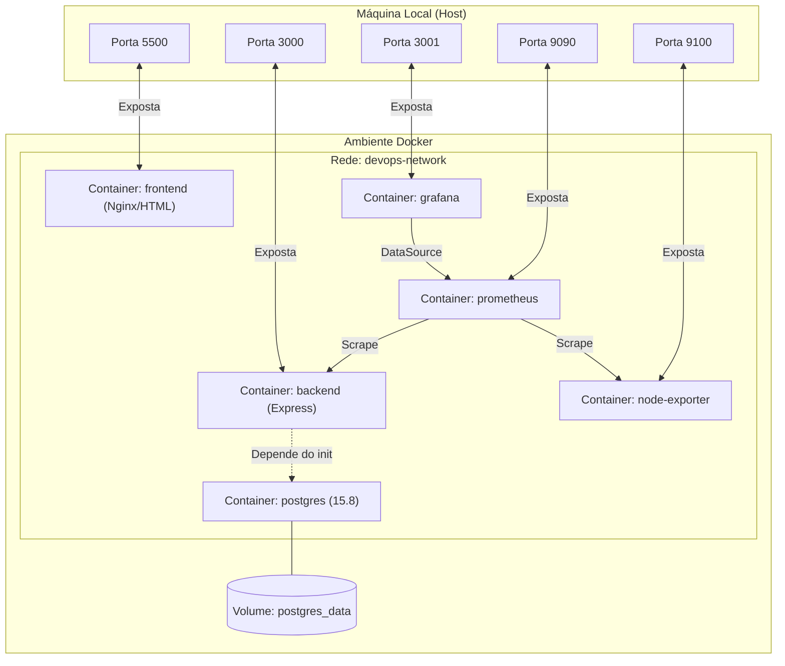

# Infraestrutura Local com Terraform e Docker (Desafio Cubos DevOps)

Este diretório contém os manifestos do **Terraform** responsáveis por provisionar, configurar e interconectar localmente toda a infraestrutura do projeto utilizando **Docker**.

A stack é composta por:
1.  **PostgreSQL**: Banco de dados relacional.
2.  **Backend App**: Aplicação Node.js/Express (com build Docker local).
3.  **Frontend App**: Servidor web da aplicação frontend (com build Docker local).
4.  **Prometheus**: Coletor de métricas de containers.
5.  **Grafana**: Painel visual de monitoramento.
6.  **Node Exporter**: Exportador de métricas do sistema operacional do host.

---

## 1. Diagrama de Arquitetura

O diagrama abaixo ilustra como os recursos do Terraform se conectam e expõem portas no host local:



---

## 2. Estrutura de Arquivos da Infraestrutura

Cada arquivo na pasta possui um papel bem definido no ciclo de vida da infraestrutura local:

| Arquivo | Componente / Função | Descrição Detalhada |
| :--- | :--- | :--- |
| 🛠️ [main.tf](file:///home/geniv/projetos/desafio-cubos-devops/terraform/main.tf) | **Provedores (Providers)** | Declara e configura os provedores necessários (`docker` para orquestração de containers e `null` para scripts auxiliares). |
| ⚙️ [variables.tf](file:///home/geniv/projetos/desafio-cubos-devops/terraform/variables.tf) | **Variáveis (Inputs)** | Declara os parâmetros ajustáveis do projeto (portas, credenciais, hosts) com tipos e valores padrão. |
| 📝 [terraform.tfvars](file:///home/geniv/projetos/desafio-cubos-devops/terraform/terraform.tfvars) | **Configuração Local** | Define os valores reais das variáveis para serem aplicados localmente neste ambiente. |
| 📄 [terraform.tfvars.example](file:///home/geniv/projetos/desafio-cubos-devops/terraform/terraform.tfvars.example) | **Modelo de Config** | Modelo demonstrativo com valores padrão para auxiliar na criação do `terraform.tfvars`. |
| 🌐 [network.tf](file:///home/geniv/projetos/desafio-cubos-devops/terraform/network.tf) | **Rede Docker** | Cria a rede bridge isolada `devops-network` possibilitando a comunicação entre containers por DNS interno. |
| 💾 [volumes.tf](file:///home/geniv/projetos/desafio-cubos-devops/terraform/volumes.tf) | **Persistência** | Configura o volume persistente `postgres_data` para assegurar que dados do banco persistam entre reinicializações. |
| 🗄️ [database.tf](file:///home/geniv/projetos/desafio-cubos-devops/terraform/database.tf) | **Banco de Dados** | Executa o PostgreSQL 15.8 e roda o script local-exec que aguarda o banco iniciar para criar tabelas e usuários admin. |
| ☕ [backend_app.tf](file:///home/geniv/projetos/desafio-cubos-devops/terraform/backend_app.tf) | **API Backend** | Compila a imagem local e executa a aplicação Node.js vinculada ao banco e à rede Docker. |
| 💻 [frontend.tf](file:///home/geniv/projetos/desafio-cubos-devops/terraform/frontend.tf) | **Frontend App** | Compila a imagem local e executa o servidor web do Frontend, expondo a porta de acesso ao usuário. |
| 📈 [prometheus.tf](file:///home/geniv/projetos/desafio-cubos-devops/terraform/prometheus.tf) | **Prometheus** | Sobe o container coletor de métricas e injeta o arquivo de regras configurado em `../monitoring/prometheus.yml`. |
| 📊 [grafana.tf](file:///home/geniv/projetos/desafio-cubos-devops/terraform/grafana.tf) | **Grafana** | Executa a ferramenta de dashboards para visualização amigável de métricas analíticas. |
| 🎛️ [node_exporter.tf](file:///home/geniv/projetos/desafio-cubos-devops/terraform/node_exporter.tf) | **Node Exporter** | Ativa a coleta de dados de recursos físicos (CPU, Memória) do host da máquina para ingestão no Prometheus. |
| 📤 [outputs.tf](file:///home/geniv/projetos/desafio-cubos-devops/terraform/outputs.tf) | **Saídas (Outputs)** | Expõe atributos dos containers (IDs, nomes de rede e volumes) ao finalizar o provisionamento. |

---

## 3. Pré-requisitos

Antes de iniciar, certifique-se de que possui as seguintes ferramentas instaladas:
*   [Terraform](https://www.terraform.io/downloads.html) (Recomendado v1.0.0 ou superior)
*   [Docker Daemon](https://docs.docker.com/get-docker/) ativo e rodando localmente

---

## 4. Variáveis de Configuração (`variables.tf`)

Você pode customizar o comportamento e as portas da infraestrutura criando/editando o arquivo `terraform.tfvars`. Veja abaixo a referência completa de variáveis:

### Banco de Dados & Backend
| Variável | Tipo | Descrição | Padrão |
| :--- | :--- | :--- | :--- |
| `DB_HOST` | `string` | Host do banco de dados PostgreSQL | `"postgres"` |
| `DB_PORT` | `number` | Porta interna/externa do PostgreSQL | `5432` |
| `DB_NAME` | `string` | Nome do banco de dados relacional | `"cubos_devops"` |
| `DB_USER` | `string` | Usuário administrador do banco | `"admin"` |
| `DB_PASSWORD` | `string` | Senha do usuário do banco | `"admin"` |
| `BACKEND_PORT` | `number` | Porta interna/externa exposta pelo Backend | `3000` |

### Frontend
| Variável | Tipo | Descrição | Padrão |
| :--- | :--- | :--- | :--- |
| `FRONTEND_INTERNAL_PORT` | `number` | Porta interna do container (nginx default) | `80` |
| `FRONTEND_EXTERNAL_PORT` | `number` | Porta exposta localmente para acessar o app | `5500` |

### Monitoramento
| Variável | Tipo | Descrição | Padrão |
| :--- | :--- | :--- | :--- |
| `GRAFANA_INTERNAL_PORT` | `number` | Porta interna do Grafana | `3000` |
| `GRAFANA_EXTERNAL_PORT` | `number` | Porta externa para acessar o painel Grafana | `3001` |
| `PROMETHEUS_INTERNAL_PORT` | `number` | Porta interna do Prometheus | `9090` |
| `PROMETHEUS_EXTERNAL_PORT` | `number` | Porta externa para acessar o Prometheus | `9090` |
| `NODE_EXPORTER_INTERNAL_PORT` | `number` | Porta interna do Node Exporter | `9100` |
| `NODE_EXPORTER_EXTERNAL_PORT` | `number` | Porta externa do Node Exporter | `9100` |

---

## 5. Inicialização Automatizada do Banco (`null_resource.database_init`)

Para evitar problemas de corrida onde a aplicação Backend inicia antes do banco de dados estar totalmente pronto para conexões, o arquivo `database.tf` implementa um recurso `null_resource.database_init`.

Este recurso executa scripts locais via `local-exec` que realizam as seguintes etapas:
1.  **Aguardar Prontidão**: Roda um loop executando `pg_isready` dentro do container postgres (máximo de 30 tentativas, esperando 2 segundos entre elas).
2.  **Criação de Schema**: Executa o script SQL para garantir que a tabela `users` exista:
    ```sql
    CREATE TABLE IF NOT EXISTS users (
      id SERIAL PRIMARY KEY,
      username VARCHAR(50) NOT NULL,
      password VARCHAR(255) NOT NULL,
      role VARCHAR(20) NOT NULL
    );
    ```
3.  **Inserção de Seed**: Insere o usuário padrão administrador (`admin` / `secure_p4$$w0rd`) com a cláusula `ON CONFLICT DO NOTHING`.

---

## 6. Instruções de Uso (Comandos)

Acesse a pasta `terraform/` no seu terminal e execute os comandos abaixo:

1.  **Inicializar o Provedor Docker**:
    ```bash
    terraform init
    ```

2.  **Visualizar o Plano de Execução**:
    ```bash
    terraform plan
    ```

3.  **Aplicar e Provisionar os Containers**:
    ```bash
    terraform apply -auto-approve
    ```

4.  **Parar e Limpar os Recursos (Remover containers, redes e volumes)**:
    ```bash
    terraform destroy -auto-approve
    ```

---

## 7. Endpoints dos Serviços

Após a execução com sucesso (`terraform apply`), os serviços estarão acessíveis nas seguintes URLs locais:

*   **Frontend Application**: [http://localhost:5500](http://localhost:5500)
*   **Backend API**: [http://localhost:3000](http://localhost:3000)
*   **Prometheus**: [http://localhost:9090](http://localhost:9090)
*   **Grafana**: [http://localhost:3001](http://localhost:3001)
*   **Node Exporter Metrics**: [http://localhost:9100/metrics](http://localhost:9100/metrics)

---

## 8. Outputs do Terraform

Ao fim da execução, o Terraform exibirá os nomes/identificadores dos recursos provisionados:
*   `container_frontend`
*   `container_backend`
*   `network`
*   `volume`
*   `container_grafana`
*   `container_prometheus`
*   `container_node_exporter`
